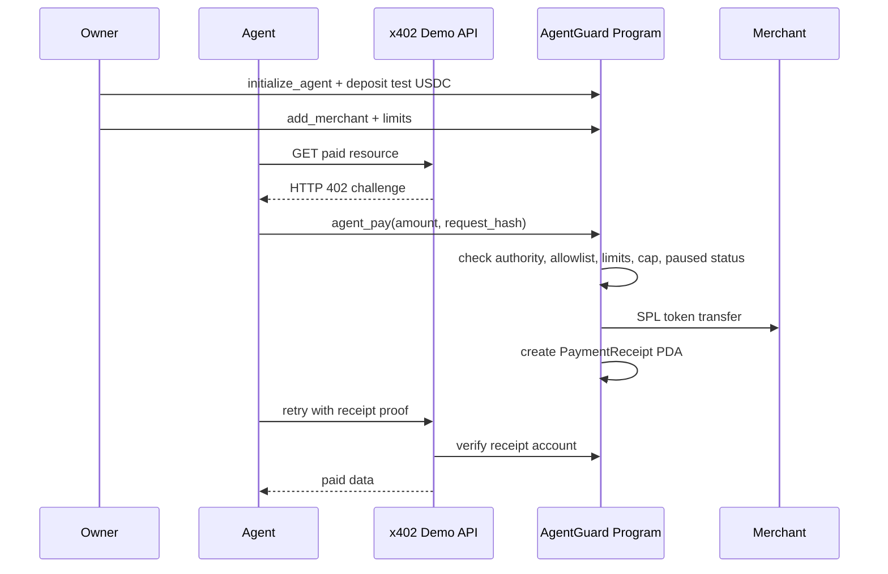

# AgentGuard Protocol

Programmable spending limits for autonomous agents on Solana.

**Give agents budgets, not private keys.**

AgentGuard Protocol is a Solana-native spending firewall for AI agents. Owners fund a policy vault, define merchant allowlists and token limits, and let an autonomous agent pay only inside those on-chain rules.

The hackathon MVP demonstrates an x402-style paid API flow: the API returns an HTTP 402 challenge, the agent pays through the AgentGuard program, the program checks policy before any token transfer, and the API unlocks paid data only after verifying the on-chain receipt PDA.

## What The MVP Proves

- AI agents can pay on Solana without receiving unrestricted wallet access.
- Owners can constrain agent spending with on-chain policy.
- Paid APIs can use AgentGuard receipts as proof of payment.
- Human operators can pause an agent through a Solana Action-style endpoint.

## Demo Flow



## Implemented

- Anchor program with policy vaults and SPL token transfers.
- Owner instructions:
  - `initialize_agent`
  - `deposit`
  - `add_merchant`
  - `set_policy`
  - `set_pause`
- Agent instruction:
  - `agent_pay`
- Policy checks before transfer:
  - agent authority
  - merchant allowlist
  - per-transaction limit
  - daily limit
  - merchant cap
  - paused status
  - mint and vault constraints
- `PaymentReceipt` PDA for successful payments.
- TypeScript SDK helpers for PDA derivation and transaction construction.
- Express x402-style demo API.
- Agent client that handles the 402 challenge, pays, and retries.
- Next.js dashboard view.
- Solana Action-style pause endpoint.
- Demo runbook and rehearsal checker.

## Quick Demo

Prerequisites:

- Solana CLI with `solana-test-validator`
- Anchor 0.32.1
- pnpm
- A local Solana wallet at `~/.config/solana/id.json`

Install and build:

```bash
pnpm install
anchor build
```

Start localnet:

```bash
solana-test-validator --reset \
  --bpf-program 3AfwmYdCAd9LeRdbiKAJuWBcGVQFtCEStbanoU5TW838 \
  target/deploy/agentguard_protocol.so
```

In another terminal, seed the demo:

```bash
pnpm --filter @agentguard/x402-demo-api seed
set -a && source .env.demo && set +a
```

Start the paid API:

```bash
set -a && source .env.demo && set +a
pnpm --filter @agentguard/x402-demo-api dev
```

Run the agent payment flow:

```bash
set -a && source .env.demo && set +a
pnpm --filter @agentguard/x402-demo-api agent
```

Expected result:

- The first API request returns an HTTP 402-style challenge.
- The agent submits `agent_pay`.
- The program creates a `PaymentReceipt` PDA.
- The API verifies the receipt and returns `paidStatus: 200`.

Run an over-limit rejection:

```bash
set -a && source .env.demo && set +a
pnpm --filter @agentguard/x402-demo-api agent:over-limit
```

Expected result:

- The program rejects the over-limit payment.
- Vault and merchant balances remain unchanged.

Check the pause Action endpoint:

```bash
set -a && source .env.demo && set +a
pnpm --filter @agentguard/web dev
```

In another terminal:

```bash
set -a && source .env.demo && set +a
pnpm --filter @agentguard/x402-demo-api check:pause-action
```

For the full rehearsal sequence, see [docs/DEMO_RUNBOOK.md](docs/DEMO_RUNBOOK.md).

## Verification

```bash
pnpm lint
pnpm -r typecheck
pnpm --filter @agentguard/web build
pnpm test:ts
```

Latest local rehearsal status:

- x402 challenge to `agent_pay` to paid data: passed.
- on-chain receipt verification: passed.
- pause Action transaction generation: passed.
- Anchor tests: 16 passing.

## Repository Layout

```text
apps/web/                  Next.js dashboard and Action endpoint
docs/                      Product docs, runbook, and demo script
packages/sdk/              TypeScript PDA and transaction helpers
programs/agentguard-protocol/
                           Anchor program
services/x402-demo-api/    Demo paid API, agent client, seed scripts
tests/                     Anchor TypeScript tests
```

## Program ID

```text
3AfwmYdCAd9LeRdbiKAJuWBcGVQFtCEStbanoU5TW838
```

## Why Solana

Agent payments need low fees, fast confirmation, cheap receipts, and composable payment surfaces. Solana provides:

- SPL token transfers for USDC-style payments.
- PDAs for policy vaults and receipt addresses.
- Fast settlement for per-request machine payments.
- Actions and Blinks for human override UX.

## Non-Goals For This MVP

- Real mainnet custody.
- Full x402 facilitator implementation.
- Natural-language policy parsing.
- Cross-chain execution.
- DeFi strategy automation.
- Enterprise compliance workflow.

## Post-MVP Roadmap

- Devnet deployment with real wallet signing.
- USDC integration.
- Facilitator-compatible x402 settlement.
- Dashboard-backed create, deposit, merchant, pause, and receipt views.
- Replay-resistant request metadata and richer receipt verification.
- Multisig or team-owned policy administration.

## License

Apache-2.0
